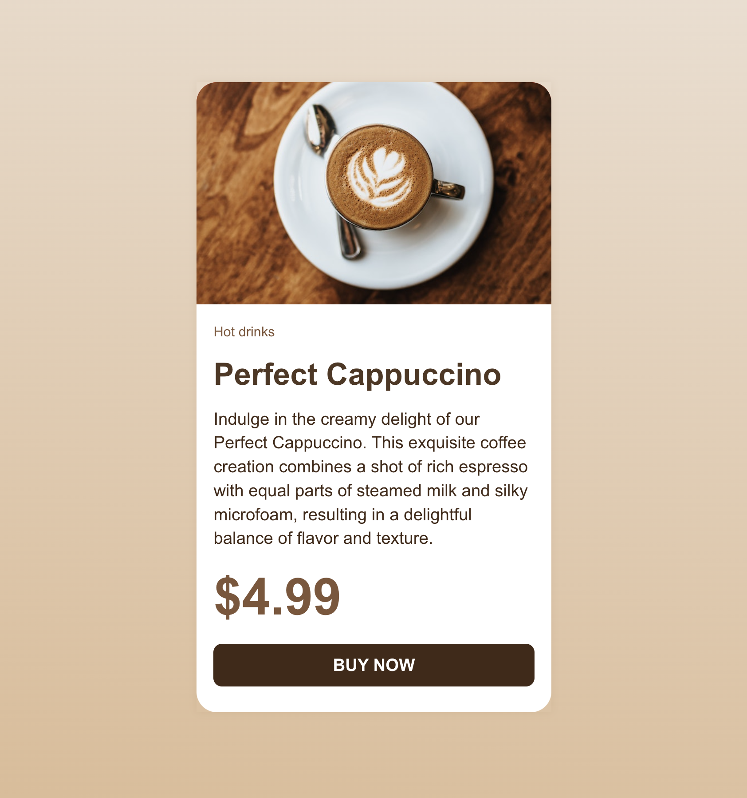

# Midterm Exam

**Course Title**: Web Development

**Course Code**: IRM1005 / ITEC1005

**Semester**: Fall 2023

**Date**: 11:30 AM on October 11, 2023

**Assessment**: This assignment is worth 10% of your final grade and marked out of 100.

## TLDR

1. Build a web page with an awesome looking Product Card using `HTML` and `CSS` that works in desktop mode and satisfies all requirements for this assignment.
2. Commit your code to your repository in GitHub.
3. Turn on GitHub Pages in your repository to host your web page online.

## Table of contents

- [Description](#description)
- [Content and design requirements](#content-and-design-requirements)
- [Acceptance criteria](#assignment-acceptance-criteria)
- [Grading rubric](#grading-rubric)
- [Late submissions](#late-submissions)
- [Checklist](#checklist)
- [Submitting your work](#submitting-your-work)
- [Frequently Asked Questions (FAQ)](#frequently-asked-questions-faq)
- [Helpful Links](#helpful-links)

## Description

This midterm will assess both your ability to structure content with semantic `HTML` tags, format text, include images and links, and apply `CSS` to a page that brings your amazing Product Card design to life. 

Students will also be assessed on their ability to commit their code to GitHub and activate the GitHub pages service.

Create and host a web page that meets the following requirements:

- Build and style one (1) web page with a file name `index.html`
- Web page must render well in desktop mode
- `CSS` must be stored in a seperate file and not be embedded in your `HTML`
- Web page must meet the content and design requirements identified within this document
- Web page must have valid and compliant HTML and CSS as assessed by the `W3C Validator`
- You must use the GitHub Repository generated by GitHub Classrooms for the midterm exam
- Web page must be hosted using GitHub Pages service
- Web page must be reachable by a browser on the public internet
- You do not need to worry about mobile mode when applying `CSS` to your page

## Content and design requirements

You are building a Product Card for a Cappuccino that could be used on the Binary Beans Cafe website. 

The Product Card has a category, title, description, price and link for making a purchase. (The button should be marked up as a link `<a>`)

The image of a cup of coffee has been provided for you in the `images` folder. 

The content for the card has been provided for you in the `index.html` file.

**You are absolutely allowed to modify the colours, image, sizing, spacing, and design elements (like background colour, border radius) to acheive your custom design. Your product card should look like this, but it deosn't have to be exactly like this.** 

**You are also asked to add your own unique design element such as a link hover state, background gradient, shadow effect, or other unique design element.**

## Acceptance criteria

- Publish your code on GitHub using the GitHub classrooms generated repository
- Use the GitHub Pages service to host your web page
- Ensure you have a license file in your repository (recommend MIT license) (already provided)

## Grading rubric

The creation and posting of this web page is worth 15% of your final grade and marked out of 100.

| Criteria                | Total&nbsp;Marks | How we define excellence                                                                                                                                                                                                                                                                                                              |
| ----------------------- | ---------------- | ------------------------------------------------------------------------------------------------------------------------------------------------------------------------------------------------------------------------------------------------------------------------------------------------------------------------------------- |
| HTML              | **35%**          | The HTML code submitted is well formed, and structured. Appropriate semantic elements are used throughout the document. Correct use of headings `<h1-h6>` and heading structure. The web page has the appropriate meta tags in the `<head>` to set the charset and viewport values.|
|CSS     | **35%**          | The  CSS code submitted is well formed, and implements the Product Card as specified in the content and design requirements. The design only has to work in desktop mode as we have yet to cover responsive design.                                                          |
| Moment of charm                  | **10%**          | Unique design elements have been added to elevate the product card. For example, a background gradient, box shadow, hover state for link, border radius (or lack thereof), changes to spacing, or any unique design elements.                                                                                                                                             |
| W3C Compliance          | **10%**          | There are no validation errors found in the code for either the HTML or CSS.                                                                                                                                                                                                                                                                                     |
| GitHub&nbsp;submission  | **10%**          | The HTML content is added to the `index.html` file and CSS is added to the `style.css` file. The repository has both the assignment README.md file and a LICENSE file that contains the MIT license. GitHub Pages services has been correctly activated.                                                                              |

## Late submissions

- There is no make up or deferred midterm exam
- Students that fail to submit a midterm will receive a mark of 0 and will have their final exam weight be adjusted to include the midterm
- For example, the midterm is worth 10% of your mark, and the final is worth 20%. If you do not attend the midterm your final exam weight will be adjusted to 30% (10% + 20%) of your final grade.

## Checklist

To help with your submission, make sure that you have reviewed the following items

- [x] Your code is committed and pushed to the GitHub repo that GitHub Classrooms created for you
- [x] The web page fulfills the minimum content and design requirements
- [x] [GitHub Pages](https://github.com/orgs/irm1005-itec1005-fall-2023/discussions/4) is activated for your repo and your web page is live and accessible.
- [x] The web page passes [W3C validation](https://validator.w3.org/#validate_by_uri) for both `HTML` and `CSS`

## Submitting your work

Your work must be submitted to your Assignment GitHub repository, which is automatically generated when you accept the assignment through GitHub Classrooms.

When you complete your work, commit and push your code to your repository. There is nothing else that you need to do to mark your assignment as completed.

There are a few ways that you can submit your work to your Assignment repository:

- Clone your GitHub repository, work off of your local machine, and commit your changes through VSCode (recommended)
- Use the GitHub code editor web interface to paste your completed code right into GitHub
- Use a developer container such as GitHub Code Spaces, StackBlitz or replit

## Frequently Asked Questions (FAQ)

<dl>
  
  <dt>What type of content should I include in the Product Card that I am building?</dt>
  <dd>The content has already been provided for you. You are permitted to add or slightly modify the content if your design warrants it.</dd>
  
  <dt>Does the web page have to work in both mobile and desktop</dt>
  <dd>No! You only need to make your web page work in desktop mode. Don't worry about mobile mode for this Assignment.</dd>

  <dt>Can I use my code from Assignment 01 or Tutorials</dt>
  <dd>Yes. Absolutely. You are permitted to use any code from any source. External sources (work that you didn't do) must be cited.</dd>
 
  <dt>Can I use trademarked or copywritten material on my page?</dt>
  <dd>Yes! As this is for educational purposes, all of the source is open, and no one is trying to sell their design or code you can absolutely use trademarked or copywritten material. Just add a comment in your code where you got the material.</dd>

  <dt>How do I cite my sources</dt>
  <dd>Just add a <code>HTML</code> comments in your <code>index.html</code> file and describe where you got the information from. If you use GitHub Copilot identify which lines in your files were generated and for ChatGPT make sure you include the prompt that you used.</dd> 
 
</dl>

## Helpful links

### HTML Resources

- [Intro to HTML - Prof3ssorSt3v3](https://www.youtube.com/watch?v=KUmuiqV1xME&list=PLyuRouwmQCjncCz8JChyPNRBvm2ONGYa2)
- [HTML Tutorial - MDN](https://developer.mozilla.org/en-US/docs/Learn/HTML)
- [Colour palettes](https://coolors.co)
- [One page love](https://onepagelove.com)

### Images and Icons

- [Pexels](https://www.pexels.com)
- [Unsplash](https://unsplash.com)
- [The noun project](https://thenounproject.com)

### GitHub

- [A short video explaining what GitHub is](https://www.youtube.com/watch?v=w3jLJU7DT5E&feature=youtu.be)
- [Git and GitHub learning resources](https://docs.github.com/en/github/getting-started-with-github/git-and-github-learning-resources)
- [Understanding the GitHub flow](https://guides.github.com/introduction/flow/)
- [How to use GitHub branches](https://www.youtube.com/watch?v=H5GJfcp3p4Q&feature=youtu.be)
- [GitHub's Learning Lab](https://lab.github.com/)
- [Education community forum](https://education.github.community/)
- [GitHub community forum](https://github.community/)

### Git

- [Interactive Git training materials](https://githubtraining.github.io/training-manual/#/01_getting_ready_for_class)
